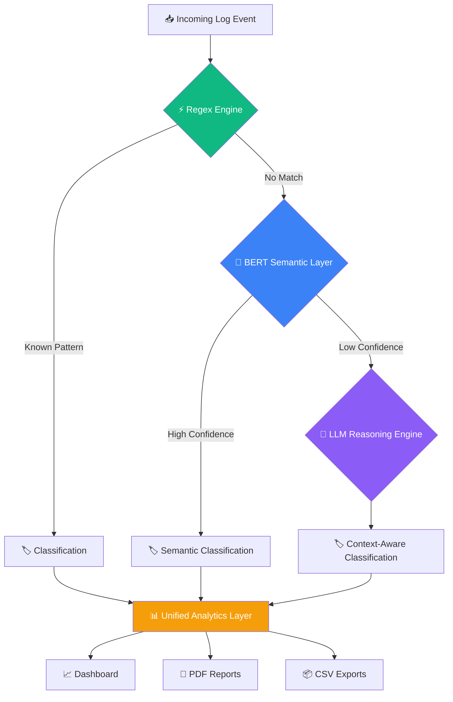

# 🧠 LogOS — Enterprise AI Log Intelligence Platform

<div align="center">

### Transforming System Noise into Actionable Intelligence

**AI-Powered Log Classification • Observability • Incident Intelligence**

Python • Streamlit • Sentence-BERT • Groq LLM • Machine Learning

---

*Built to demonstrate modern AI Operations (AIOps) architecture using a Hybrid Intelligence Pipeline.*

</div>

---

# 🚀 Overview

Modern systems generate millions of logs every day.

Engineers spend countless hours manually inspecting logs, identifying incidents, and determining severity levels.

**LogOS** solves this problem through a **Hybrid AI Pipeline** that combines:

- ⚡ Deterministic Pattern Matching (Regex)
- 🧠 Semantic Understanding (Sentence-BERT)
- 🤖 Deep Contextual Reasoning (LLM)

The result is a fast, scalable, and intelligent log classification platform capable of transforming raw machine-generated events into meaningful operational insights.

---

# 🎯 Business Problem

Traditional monitoring systems struggle with:

❌ Alert fatigue

❌ Repetitive manual triage

❌ Unknown error patterns

❌ Lack of semantic understanding

❌ High LLM inference costs

LogOS introduces a **waterfall intelligence architecture** that minimizes cost while maximizing accuracy.

---

# 🏛 Enterprise Architecture



---

# 🧠 Hybrid Intelligence Pipeline

| Stage | Engine | Purpose | Performance |
|---------|---------|---------|---------|
| ⚡ Layer 1 | Regex Engine | Detect known patterns instantly | Fastest |
| 🧠 Layer 2 | Sentence-BERT | Semantic understanding of logs | Fast |
| 🤖 Layer 3 | Groq LLM | Deep reasoning for unknown logs | Most Intelligent |

---

# 🔥 Key Innovation

Instead of sending every log to an LLM:

```text
Regex → BERT → LLM
```

The system intelligently escalates only when necessary.

### Benefits

- Lower cost
- Faster response times
- Better scalability
- Reduced hallucinations
- Explainable decision path

---

# 🖥 Platform Experience

## 🛰 Observability Mode

Enterprise SOC-inspired interface.

Features:

- Real-time log analysis
- Live classification results
- Pipeline execution visualization
- Confidence scoring
- System health indicators

---

## 📊 Executive Dashboard

Management-friendly analytics.

Includes:

- Model Routing Distribution
- Confidence Distribution
- Label Distribution
- Average Confidence Score
- Total Logs Processed
- Classification Accuracy Indicators

Example Metrics:

```text
Total Logs Processed      1,250
Average Confidence        91%
Regex Resolution Rate     68%
BERT Resolution Rate      24%
LLM Escalation Rate       8%
```

---

## 🐞 Debug Console

Designed for ML Engineers.

Provides:

- Pipeline trace
- Routing decisions
- Confidence analysis
- Model diagnostics
- Raw telemetry inspection

---

# 📊 Analytics Layer

LogOS continuously tracks:

## Model Usage Distribution

```text
Regex   ████████████ 65%
BERT    ██████ 25%
LLM     ██ 10%
```

## Confidence Distribution

```text
High Confidence     ███████████ 72%
Medium Confidence   ████ 20%
Low Confidence      ██ 8%
```

## Top Incident Categories

```text
Infrastructure Error
Security Alert
Workflow Failure
API Error
Deprecation Warning
System Notification
User Action
```

---

# 📦 Batch Processing Engine

Upload thousands of logs through CSV.

### Input

```csv
log_message
Database timeout after 30 seconds
User login failed for account 123
API endpoint returned HTTP 500
```

### Output

```csv
log_message,label,method,confidence
Database timeout after 30 seconds,Infrastructure Error,bert,0.91
User login failed for account 123,Security Alert,regex,0.98
API endpoint returned HTTP 500,Workflow Error,bert,0.87
```

---

# 📄 Enterprise Reporting

Generate:

✅ CSV Reports

✅ PDF Reports

✅ Dashboard Snapshots

Suitable for:

- Compliance Audits
- Incident Reviews
- Executive Briefings
- Operational Analytics

---

# 🧰 Technology Stack

## Backend

- Python
- Scikit-Learn
- Sentence Transformers
- Joblib
- Groq API

## AI Models

- all-MiniLM-L6-v2
- Logistic Regression Classifier
- DeepSeek-R1 Distill Llama 70B

## Frontend

- Streamlit
- Plotly

## Data Processing

- Pandas
- NumPy

## Reporting

- ReportLab
- CSV Export Engine

---

# 📂 Project Structure

```text
project-nlp-log-classification/

├── backend/
│   ├── service.py
│   ├── main.py
│   └── processors/
│       ├── processor_regex.py
│       ├── processor_bert.py
│       └── processor_llm.py
│
├── frontend/
│   └── app.py
│
├── models/
│   └── log_classifier.joblib
│
├── shared/
│   └── schemas.py
│
├── resources/
│   ├── test.csv
│   ├── output.csv
│   └── arch.png
│
├── requirements.txt
├── README.md
└── server.py
```

---

# ⚙️ Installation

## Clone Repository

```bash
git clone https://github.com/yourusername/logos-ai.git

cd logos-ai
```

## Create Virtual Environment

```bash
python -m venv venv

source venv/bin/activate
```

## Install Dependencies

```bash
pip install -r requirements.txt
```

## Configure Environment

Create a `.env` file:

```env
GROQ_API_KEY=YOUR_GROQ_API_KEY
```

---

# ▶️ Launch Application

```bash
PYTHONPATH=. streamlit run frontend/app.py
```

Open:

```text
http://localhost:8501
```

---

# 🧪 Sample Logs

### Infrastructure Error

```text
Database connection timeout after 30 seconds
```

### Security Alert

```text
Multiple login failures detected for user 4567
```

### API Failure

```text
GET /api/v1/orders returned HTTP 500 Internal Server Error
```

### Workflow Error

```text
Invoice generation failed due to missing customer data
```

### Deprecation Warning

```text
The ReportGenerator module will be retired in version 4.0
```

### System Notification

```text
Backup completed successfully
```

### User Action

```text
User User123 logged in successfully
```

---

# 🔮 Future Roadmap

## Phase 2

- Kafka Streaming Ingestion
- Redis Event Queue
- FastAPI Backend
- Docker Deployment
- Kubernetes Scaling

## Phase 3

- Vector Database Integration
- Retrieval-Augmented Log Intelligence
- Root Cause Analysis Engine
- AI Incident Summaries
- Multi-Tenant SaaS Support

## Phase 4

- OpenTelemetry Integration
- SIEM Connectivity
- SOC Alert Correlation
- Autonomous Incident Resolution

---

# 💡 Why This Project Matters

LogOS demonstrates how modern enterprises can combine:

- Deterministic Systems
- Machine Learning
- Generative AI

into a single production-oriented intelligence platform.

It showcases principles used by leading observability and security vendors while remaining lightweight, explainable, and extensible.

---

<div align="center">

## 🧠 LogOS

### Enterprise Observability Intelligence

**Turning Logs Into Decisions.**

Built with ❤️ using Python, Streamlit, BERT, and LLMs.

</div>
